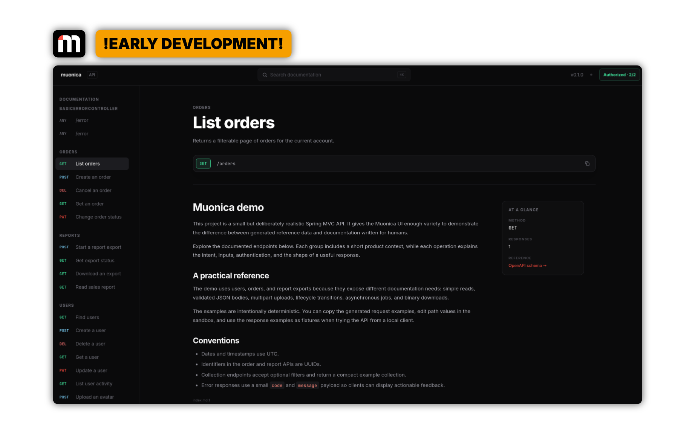

# Muonica


[](LICENSE)

Muonica is an extensible API documentation library for Spring Boot. It scans Spring MVC applications into a framework-independent model, combines generated API metadata with Markdown written for humans, and exposes both an interactive documentation UI and an OpenAPI 3.1.1 document.

Muonica's Java model is the source of truth. Spring integration, the UI, and OpenAPI are adapters around that model.



## Features

- Automatic discovery of Spring MVC endpoints, parameters, request and response schemas, validation constraints, multipart parts, and security metadata.
- Explicit annotations for project information, groups, operations, responses, and security schemes.
- Markdown documentation packaged with the application JAR.
- Documentation inheritance from project to group to endpoint.
- Generated technical sections for requests, responses, parameters, and security requirements.
- Notices and Mermaid diagrams through lightweight Markdown directives.
- A framework-free UI served directly by the Spring integration module.
- OpenAPI 3.1.1 export from the neutral Muonica model.
- Strict documentation validation by default, with optional warnings for non-strict environments.

## Modules

- `muonica-core` — framework-independent annotations and documentation model.
- `muonica-spring` — Spring MVC scanner, documentation composition, auto-configuration, and web endpoints.
- `muonica-openapi` — OpenAPI 3.1.1 export adapter.
- `muonica-ui` — bundled Muonica Pages frontend and static resources.
- `muonica-demo` — executable Spring Boot application used as a reference implementation and integration test fixture.

## Getting Started (for Developers)

### Prerequisites

- JDK 17 or newer
- A terminal, or IntelliJ IDEA with Gradle support

The repository includes a Gradle wrapper, so a separate Gradle installation is not required.

### Build and test

From the repository root:

```bash
./gradlew test
```

To build every module:

```bash
./gradlew build
```

### Run the demo application

Start the reference Spring Boot application with:

```bash
./gradlew :muonica-demo:bootRun
```

Once the application starts, open [http://localhost:8080/muonica](http://localhost:8080/muonica) to view the generated documentation.

The demo also exposes the underlying representations:

| Endpoint | Description |
| --- | --- |
| `/muonica` | Redirects to the documentation UI. |
| `/muonica/api` | Returns the Muonica JSON model. |
| `/muonica/openapi.json` | Returns the generated OpenAPI 3.1.1 document. |

## Add Muonica to an Application

Add the Spring integration module to the application that should expose documentation. In this multi-module build, the demo uses:

```kotlin
dependencies {
    implementation(project(":muonica-spring"))
}
```

Muonica is auto-configured for servlet-based Spring Boot applications. Add project-level metadata and a Markdown resource to the application class:

```java
@SpringBootApplication
@MuonicaProject(
        title = "Example API",
        version = "1.0.0",
        description = "An API documented with Muonica."
)
@MuonicaDocumentation(file = "classpath:/muonica/index.md")
public class ExampleApplication {
    public static void main(String[] args) {
        SpringApplication.run(ExampleApplication.class, args);
    }
}
```

Annotate controllers and handler methods when generated metadata needs additional context:

```java
@RestController
@RequestMapping("/users")
@MuonicaGroup(name = "Users", description = "Manage users.")
@MuonicaDocumentation(file = "classpath:/muonica/users/index.md")
class UserController {
    @GetMapping("/{id}")
    @MuonicaOperation(summary = "Get a user", description = "Returns a user by identifier.")
    @MuonicaDocumentation(file = "classpath:/muonica/users/get-user.md")
    UserResponse getUser(@PathVariable long id) {
        // ...
    }
}
```

## Write Markdown Documentation

Markdown resources are loaded from the classpath and composed with the generated API reference. A resource can contain regular Markdown and Muonica directives:

```markdown
# Get a user

Returns the user profile for the requested identifier.

:::notice warning
The endpoint requires an authenticated request.
:::

:::slot parameters
:::

:::slot responses
:::
```

Supported directives include:

- `:::notice info`, `:::notice warning`, and `:::notice danger`
- `:::diagram mermaid`
- `:::slot security`, `:::slot request`, `:::slot responses`, and `:::slot parameters`

Documentation is resolved and cached during application startup. If a source is invalid, Muonica fails fast by default. To keep the application running and expose diagnostics in the JSON model instead, configure:

```yaml
muonica:
  documentation:
    strict: false
```

## Architecture

```text
Spring MVC application
        ↓
   muonica-spring
        ↓
    muonica-core
     ↙       ↘
  Muonica UI  OpenAPI 3.1.1
```

The core model remains independent of Spring and OpenAPI. This keeps the scanner, UI, and exporters replaceable without changing the documentation model itself.

## Contributing

Contributions and improvements are welcome. Before opening a change:

1. Run `./gradlew test`.
2. Keep new functionality covered by unit or integration tests where practical.
3. Follow the existing Java and Kotlin Gradle build conventions.
4. Use a Conventional Commit message, for example `feat(spring): add custom documentation endpoint support`.

## License

Muonica's code is licensed under the [Apache License, Version 2.0](LICENSE).
The project name and branding are covered separately by the
[trademark and branding policy](TRADEMARKS.md).
